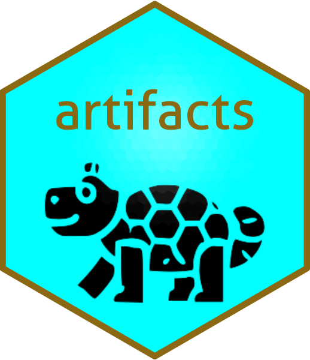

#  ncartifactgenerator

## Summary

This library takes the 3D gridded datasets from `data_flow` and `index_flow` and creates the objects necessary to serve the information on the web-based visualisation tools.

## Details

The objects created consist on netCDF files with structure optimized to serve information to the web interface, plus JSON index files needed to find the precise data requested by the user.

## Instructions

