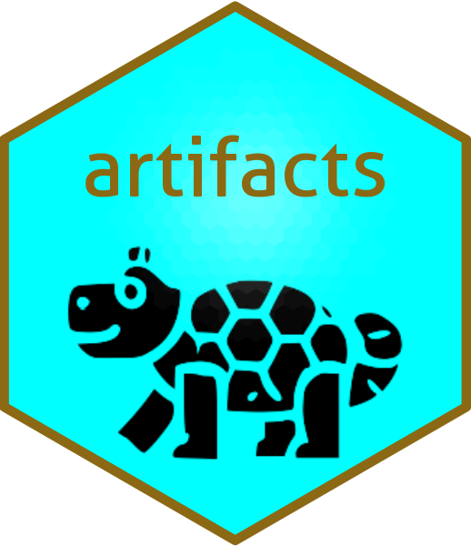

#  ncartifactgenerator

An R package that converts 3D gridded NetCDF files into the artefacts required to serve climate data directly from static file storage to web-based viewers, without a GeoServer or OGC endpoint. It is the **final stage** of the PTI+ Clima data pipeline, transforming the output of the [`indexCalc`](https://github.com/PTI-Clima/indexCalc) and [`data_flow`](https://github.com/PTI-Clima/data_flow) repositories into files that can be consumed by a browser using plain HTTP range requests.


## Purpose

Standard NetCDF files are laid out on disk in row-major order, which is inefficient when a web client needs either (a) the full time series for a single pixel, or (b) a spatial map for a single date. This package solves the problem by producing two complementary rechunked copies of each NetCDF file, one optimised for each access pattern, together with compact binary index files that tell the browser exactly which byte range to fetch.

The outputs for a single variable and spatial domain are:

| File | Chunk structure | Optimal for |
|---|---|---|
| `<var><portion>-t.nc` | 1 × 1 × T | Pixel time-series queries |
| `<var><portion>-t.bin` | 12 bytes × (lon × lat) | Byte offset index for `-t.nc` |
| `<var><portion>-xy.nc` | X × Y × 1 | Map queries (single date) |
| `<var><portion>-xy.bin` | 12 bytes × T | Byte offset index for `-xy.nc` |
| `times.json` | — | Global metadata: extents, time steps, value ranges |

The web viewer uses `times.json` to discover available variables and dates, and the `.bin` index files to issue a single HTTP range request that retrieves exactly the right chunk from the corresponding `.nc` file.


## Repository Structure

```
ncartifactgenerator/
├── R/
│   ├── functions.R      ← NetCDF utilities, generate_artifacts(), config_web()
│   ├── chunk.R          ← write_nc_chunk_t/xy(), write_nc_*_chunk_dir_iter()
│   └── config-web.R     ← config_web(), writeJson()
├── docker/
│   ├── Dockerfile       ← Reproducible image with HDF5 ≥ 1.12.2 and the patched hdf5r
│   └── Rinstall.sh      ← Helper script used by the Dockerfile to install R packages
├── man/                 ← Roxygen-generated documentation
└── DESCRIPTION          ← Package metadata
```


## Prerequisites

- **R ≥ 1.8.0**
- R packages: `ncdf4`, `hdf5r` (patched fork, see below), `bit64`, `js`, `sf`, `raster`, `R.utils`
- **HDF5 system library ≥ 1.12.2** (see below)

Most dependencies are listed in `DESCRIPTION` and are installed automatically by `install.packages()` or `devtools::install_github()`. However, two of them require special attention:

### Patched `hdf5r` fork

To build the `.bin` chunk index files, the package needs to query the byte offset and size of every chunk stored inside the rechunked NetCDF/HDF5 files. The HDF5 C library exposes this through the `H5Dget_chunk_info_by_coord()` function, but the CRAN release of [`hdf5r`](https://github.com/hhoeflin/hdf5r) does not wrap it. For this reason we maintain a fork of the library at [lcsc/hdf5r](https://github.com/lcsc/hdf5r) (branch `chunk_functions`) that exposes `get_chunk_info_by_coord` to R code. You must install this fork instead of the CRAN version:

```r
devtools::install_github("lcsc/hdf5r@chunk_functions")
```

### HDF5 system library ≥ 1.12.2

`H5Dget_chunk_info_by_coord()` and the related chunk-query API are only fully available and reliable in **HDF5 1.12.2 or later**, so the HDF5 library provided by the operating system (against which `hdf5r` is compiled) must meet this minimum version. You can check the installed version with:

```sh
h5cc -showconfig | grep "HDF5 Version"
# or
pkg-config --modversion hdf5
```

If your distribution ships an older HDF5 (e.g. Ubuntu 22.04 ships 1.10.7 and Ubuntu 24.04 ships 1.10.10), install a recent release from the [HDF Group](https://www.hdfgroup.org/downloads/hdf5/) before compiling `hdf5r`, or simply use the Docker image described below, which takes care of both requirements.


## Installation

```r
# From GitHub
devtools::install_github("PTI-Clima/ncartifactgenerator")

# Or from a local clone
devtools::install("path/to/ncartifactgenerator")
```


## Usage

The typical call pattern, as used by the `lcsc-dags` viewer scripts, is:

```r
library('ncartifactgenerator')

nc_root  <- "/path/to/nc/input"    # directory containing source NetCDF files
out_root <- "/path/to/web/output"  # directory for generated artefacts
epsg     <- "4326"                 # EPSG code of input files

# Define variables to process: one row per (variable, source file, spatial portions)
ncVars <- data.frame(
  var      = c("ffd",  "lfd"),
  file     = c("primera_helada/ff", "ultima_helada/lf"),
  stringsAsFactors = FALSE
)
portions <- c("_pen", "_can")

# Process each variable × portion, accumulating metadata into info_js
info_js <- NA
for (i in seq_len(nrow(ncVars))) {
  for (portion in portions) {
    info_js <- generate_artifacts(
      nc_root      = nc_root,
      out_root     = out_root,
      nc_filename  = ncVars$file[i],
      portion      = portion,
      var_id       = ncVars$var[i],
      epsg         = epsg,
      info_js      = info_js,
      write        = FALSE
    )
  }
}

# Write the final times.json index
writeJson(
  folder      = out_root,
  infoJs      = info_js,
  varTitle    = list("ffd" = "First frost day", "lfd" = "Last frost day"),
  legendTitle = list("ffd" = "days", "lfd" = "days"),
  minify      = TRUE
)
```

`generate_artifacts()` is idempotent: it skips rechunking steps whose output file is already newer than the source NetCDF, so re-running after a partial failure is safe.


## Running with Docker

Because the package depends on a patched `hdf5r` fork and on HDF5 ≥ 1.12.2 (see [Prerequisites](#prerequisites)), the easiest way to get a working environment is the Docker image defined in [docker/Dockerfile](docker/Dockerfile). The image is based on the [rocker devcontainer](https://github.com/rocker-org/devcontainer-images) images and performs three steps:

1. Installs **HDF5 1.14.2** from the official HDF Group binary release, satisfying the ≥ 1.12.2 requirement.
2. Installs the patched **`lcsc/hdf5r`** fork (branch `chunk_functions`) together with the remaining R dependencies, using the `Rinstall.sh` helper script and [`pak`](https://pak.r-lib.org/).
3. Installs **`ncartifactgenerator`** itself from GitHub.

### Building the image

```sh
cd docker
docker build . -t ncartifactgenerator
```

The build can be customised with build arguments (defaults shown):

```sh
docker build . -t ncartifactgenerator \
  --build-arg VARIANT=4.3 \                          # R version
  --build-arg BASE_IMAGE=tidyverse \                 # rocker devcontainer flavour
  --build-arg HDF5_BRANCH=chunk_functions \          # branch of lcsc/hdf5r
  --build-arg NCARTIFACTGENERATOR_BRANCH=master      # branch of lcsc/ncartifactgenerator
```

### Running a generation script

Save the script from the [Usage](#usage) section (e.g. as `generate.R`), adjusting `nc_root` and `out_root` to paths *inside the container*, and run it by mounting the input and output directories as volumes:

```sh
docker run --rm \
  -v /path/to/nc/input:/data/input:ro \
  -v /path/to/web/output:/data/output \
  -v "$(pwd)/generate.R":/data/generate.R:ro \
  ncartifactgenerator \
  Rscript /data/generate.R
```

with the script using the mounted paths:

```r
nc_root  <- "/data/input"
out_root <- "/data/output"
```

The container already has the package installed, so the script can start directly with `library('ncartifactgenerator')`. Alternatively, you can open an interactive R session inside the container:

```sh
docker run --rm -it \
  -v /path/to/nc/input:/data/input:ro \
  -v /path/to/web/output:/data/output \
  ncartifactgenerator R
```

### Using the image as a Dev Container

The image can also be used as a [VS Code Dev Container](https://containers.dev/), which is convenient for developing the package itself: instead of only *running* a script inside the container (as above), VS Code (and forks) attaches to the container and the integrated terminal, the R interpreter and any extensions run inside it, while the project directory on your disk is mounted into the container so you edit the real source files.

The repository ships a ready-to-use configuration in [.devcontainer/devcontainer.json](.devcontainer/devcontainer.json):

```jsonc
{
	"name": "ncartifactgenerator",
	"build": {
		"dockerfile": "../docker/Dockerfile",
		"context": "../docker"
	},
	"features": {
		"ghcr.io/rocker-org/devcontainer-features/rstudio-server": {}
	},
	"postCreateCommand": {
		"rstudio-start": "rserver"
	},
	"forwardPorts": [8787]
}
```

The `build` block points at the same [docker/Dockerfile](docker/Dockerfile) used for standalone `docker run` execution, so no manual `docker build` is needed: VS Code builds the image automatically the first time the devcontainer is opened. To use it:

1. Open the repository in VS Code with the [Dev Containers extension](https://marketplace.visualstudio.com/items?itemName=ms-vscode-remote.remote-containers) installed.
2. Run the *"Dev Containers: Reopen in Container"* command.

VS Code builds the image (on first use), starts a container from it, mounts the repository under `/workspaces/ncartifactgenerator`, and every R session you open already has HDF5 1.14.2 and the patched `hdf5r` fork available, so you can iterate on the package with `devtools::load_all()` without touching your host system. The `features` block additionally installs **RStudio Server** inside the container, started automatically by the `postCreateCommand`; thanks to `forwardPorts`, it is reachable in your browser at `http://localhost:8787`.

This works because the base image of the Dockerfile, `ghcr.io/rocker-org/devcontainer/tidyverse`, is specifically designed for devcontainer use and is compatible with the [rocker devcontainer features](https://github.com/rocker-org/devcontainer-features).


## Output

For a call with `var_id = "ffd"`, `portion = "_pen"`, and `out_root = "/data/web/amm"`:

```
/data/web/amm/
├── nc/
│   ├── ffd_pen-t.nc      ← rechunked NetCDF (pixel time-series)
│   ├── ffd_pen-t.bin     ← pixel index (lon×lat entries of 12 bytes each)
│   ├── ffd_pen-xy.nc     ← rechunked NetCDF (date maps)
│   └── ffd_pen-xy.bin    ← date index (T entries of 12 bytes each)
└── times.json            ← metadata index for all processed variables
```


## Key Functions

| Function | Description |
|---|---|
| `generate_artifacts()` | Main entry point; runs the full 5-step pipeline for one variable + portion |
| `writeJson()` | Writes `times.json` from accumulated metadata after all variables are processed |
| `fusion_pen_can()` | Merges separate peninsular and Canary Islands NetCDF files into one grid |
| `write_nc_chunk_t()` | Creates the time-series-optimised rechunked NetCDF (`-t.nc`) |
| `write_nc_chunk_xy()` | Creates the map-optimised rechunked NetCDF (`-xy.nc`) |
| `write_nc_t_chunk_dir_iter()` | Creates the binary pixel index (`-t.bin`) |
| `write_nc_xy_chunk_dir_iter()` | Creates the binary date index (`-xy.bin`) |
| `config_web()` | Accumulates per-variable spatial extent and value-range metadata |


## Further Documentation

See [docs/full_documentation.md](docs/full_documentation.md) for a full description of the serverless access architecture, the rechunking and binary index algorithms, the `times.json` schema, and complete function-level API reference.


## License

GPL (≥ 3) — see [LICENSE.md](LICENSE.md).


## Authors

Borja Latorre-Garcés (EEAD-CSIC), Fergus Reig-Gracia (IPE-CSIC), Eduardo Moreno-Lamana (IPE-CSIC), Daniel Vilas-Perulán (EEAD-CSIC), Manuel Arretxea-Iriarte (IGEO-CSIC).
